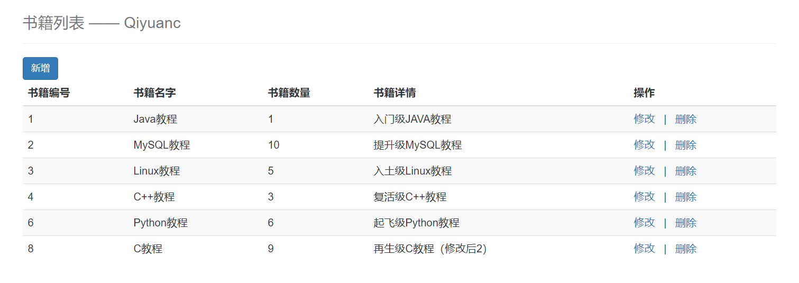
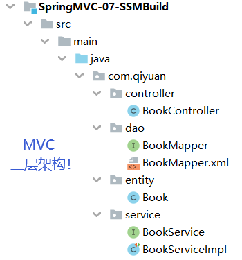
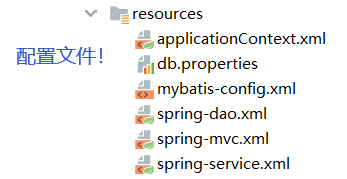
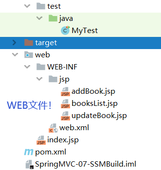

## SSM框架整合 SpringMVC层

通过对 Spring 和 MyBatis 的配置，MVC 架构中的 Model 层就算搭建完了，现在就要开始搭建MVC 中的 Controller 层——SpringMVC 了！

### 1. 配置Web

首先要为项目添加 Web 框架，这样才有 Web 的配置文件 web.xml

```xml
<?xml version="1.0" encoding="UTF-8"?>
<web-app xmlns="http://xmlns.jcp.org/xml/ns/javaee"
         xmlns:xsi="http://www.w3.org/2001/XMLSchema-instance"
         xsi:schemaLocation="http://xmlns.jcp.org/xml/ns/javaee http://xmlns.jcp.org/xml/ns/javaee/web-app_4_0.xsd"
         version="4.0">
    
</web-app>
```

使用 SpringMVC，就是将请求都交给 SpringMVC 处理，所以需要**中央控制器 `DispatcherServlet`**

```xml
    <servlet>
        <servlet-name>DispatcherServlet</servlet-name>
        <servlet-class>org.springframework.web.servlet.DispatcherServlet</servlet-class>
        <init-param>
            <!-- 这里要加载总的配置文件，其中包含了 spring-mvc.xml -->
            <param-name>contextConfigLocation</param-name>
            <param-value>classpath:applicationContext.xml</param-value>
        </init-param>
    </servlet>
    <servlet-mapping>
        <servlet-name>DispatcherServlet</servlet-name>
        <url-pattern>/</url-pattern>
    </servlet-mapping>
```

注意此处绑定的是总的配置文件 applicationContext.xml，在总配置文件中包含 spring-mvc.xml 即可！

有了中央控制器后，还需要配置**过滤器**以解决编码的问题，这里使用 SpringMVC 自带的过滤器（**不要忘了过滤器也有属性！**）

```xml
    <filter>
        <filter-name>EncodingFilter</filter-name>
        <filter-class>org.springframework.web.filter.CharacterEncodingFilter</filter-class>
        <!-- 不要忘了设置属性。。。 -->
        <init-param>
            <param-name>encoding</param-name>
            <param-value>utf-8</param-value>
        </init-param>
    </filter>
    <filter-mapping>
        <filter-name>EncodingFilter</filter-name>
        <!-- 过滤所有请求，包括 jsp -->
        <url-pattern>/*</url-pattern>
    </filter-mapping>
```

注意 `/*` 为过滤所有请求及页面，而 `/` 为只过滤请求！

最后为了保证安全，设置一下 Session 的过期时间

```xml
    <session-config>
        <session-timeout>15</session-timeout>
    </session-config>
```

这样 web.xml 就配置完了！

### 2. 配置SpringMVC

接下来配置 SpringMVC，在 resources 目录下创建 spring-mvc.xml（和学习的时候命名不一样了）

```xml
<?xml version="1.0" encoding="UTF-8"?>
<beans xmlns="http://www.springframework.org/schema/beans"
       xmlns:xsi="http://www.w3.org/2001/XMLSchema-instance"
       xmlns:context="http://www.springframework.org/schema/context"
       xmlns:mvc="http://www.springframework.org/schema/mvc"
       xsi:schemaLocation="http://www.springframework.org/schema/beans
   http://www.springframework.org/schema/beans/spring-beans.xsd
   http://www.springframework.org/schema/context
   http://www.springframework.org/schema/context/spring-context.xsd
   http://www.springframework.org/schema/mvc
   https://www.springframework.org/schema/mvc/spring-mvc.xsd">
    
</beans>
```

首先要开启注解的支持（用 SpringMVC 还不用注解赶紧埋了）

```xml
    <!-- 开启注解 -->
    <mvc:annotation-driven/>
```

设置 `DispatcherServlet` 不处理静态资源（静态资源被当成请求处理就访问不到了）

```xml
    <!-- 静态资源默认 servlet 配置 -->
    <mvc:default-servlet-handler/>
```

配置视图解析器 `ViewResolver` 将视图解析为 jsp 文件（好 LOW 我要受不了了）

```xml
    <!-- 配置视图解析器 ViewResolver -->
    <bean class="org.springframework.web.servlet.view.InternalResourceViewResolver">
        <property name="prefix" value="/WEB-INF/jsp/" />
        <property name="suffix" value=".jsp" />
    </bean>
```

最后，用到了注解当然要开启注解扫描了

```xml
    <!-- 扫描指定包下的注解 -->
    <context:component-scan base-package="com.qiyuan.controller"/>
```

如果不用注解最后这步就是配置控制器的 bean 了，有多少个控制器就要配置多少个 bean！让我看看谁不用注解！

这样 SpringMVC 的配置文件就配置好了，把它纳入总的配置文件 `applicationContext.xml` 中

```xml
    <import resource="spring-dao.xml"/>
    <import resource="spring-service.xml"/>
    <import resource="spring-mvc.xml"/>
```

至此，三部分的配置文件都完成了，它们汇聚成了整个 SSM 框架的配置文件！

### 3. 编写控制器Controller

通过之前的配置，项目的框架和配置都搭建完成了！接下来就是添加业务了，流程为：前端发起请求——控制器——业务处理——返回视图，先把中转站控制器给写了！

在 com.qiyuan.controller 包下，编写控制器 BookController 类

```java
@Controller
@RequestMapping("/book")
public class BookController {
    // 自动装配 bean
    @Autowired
    @Qualifier("BookServiceImpl")
    private BookService bookService;
}
```

通过注解定义使其成为一个控制器，类请求路径为 `/book`，内置了一个 `BookService` 对象以执行业务，这个对象通过自动装配的方式注入！

有了控制器，通过在其中添加方法就可以处理请求了（配置 Tomcat、导入 lib 的过程就省略了）！

### 4. 编写请求方法与前端页面

现在，对于某个业务请求，在控制器中添加处理请求的方法，将数据保存在模型中，返回对应的视图将数据展示出来，就是完整的业务流程了！

#### 4.1 书籍列表

首先，需要有页面展示出所有的书籍，在控制器中添加查询全部书籍的方法

```java
public class BookController {
    ...
    
    public String queryAllBook(Model model){
        // 调用业务层执行业务，业务层调用 Dao 层获取数据！
        List<Book> books = bookService.queryAllBook();
        // 将结果放入 Model 中
        model.addAttribute("booksList",books);
        // 返回视图
        return "booksList";
    }
}
```

返回视图经过视图解析器后会变成 `/WEB-INF/jsp/booksList.jsp`，要写前端页面了（凑合看明白就行了，后面再慢慢学吧）！

先编写首页 `index.jsp`，从首页可以进入书籍列表的页面（简单设置了一下样式）

```jsp
<%@ page language="java" contentType="text/html; charset=UTF-8" pageEncoding="UTF-8" %>
<!DOCTYPE HTML>
<html>
<head>
  <title>首页</title>
  <style type="text/css">
    a {
      text-decoration: none;
      color: black;
      font-size: 18px;
    }
    h3 {
      width: 180px;
      height: 38px;
      margin: 100px auto;
      text-align: center;
      line-height: 38px;
      background: deepskyblue;
      border-radius: 4px;
    }
  </style>
</head>
<body>
<h3>
  <a href="${pageContext.request.contextPath}/book/booksList">点击进入列表页</a>
</h3>
</body>
</html>
```

然后是 `booksList.jsp` 页面，**展示所有书籍并提供选项进行新增书籍、删除书籍、修改书籍操作**（用到了 jstl 标签，需要导入 jstl 包和 standard 包！），这个页面是可以复用的（未在计划中的模糊查询）！

```jsp
<%@ taglib prefix="c" uri="http://java.sun.com/jsp/jstl/core" %>
<%@ page contentType="text/html;charset=UTF-8" language="java" %>

<html>
<head>
    <title>书籍列表</title>
    <meta name="viewport" content="width=device-width, initial-scale=1.0">
    <!-- 引入 Bootstrap -->
    <link href="https://cdn.bootcss.com/bootstrap/3.3.7/css/bootstrap.min.css" rel="stylesheet">
</head>
<body>

<div class="container">

    <div class="row clearfix">
        <div class="col-md-12 column">
            <div class="page-header">
                <h1>
                    <small>书籍列表 —— Qiyuanc</small>
                </h1>
            </div>
        </div>
    </div>

    <div class="row">
        <div class="col-md-4 column">
            <a class="btn btn-primary" href="${pageContext.request.contextPath}/book/toAddBook">新增</a>
        </div>
    </div>

    <div class="row clearfix">
        <div class="col-md-12 column">
            <table class="table table-hover table-striped">
                <thead>
                <tr>
                    <th>书籍编号</th>
                    <th>书籍名字</th>
                    <th>书籍数量</th>
                    <th>书籍详情</th>
                    <th>操作</th>
                </tr>
                </thead>

                <tbody>
                <c:forEach var="book" items="${requestScope.get('booksList')}">
                    <tr>
                        <td>${book.getBookID()}</td>
                        <td>${book.getBookName()}</td>
                        <td>${book.getBookCounts()}</td>
                        <td>${book.getDetail()}</td>
                        <td>
                            <a href="${pageContext.request.contextPath}/book/updateBook?id=${book.getBookID()}">更改</a> |
                            <a href="${pageContext.request.contextPath}/book/deleteBook/${book.getBookID()}">删除</a>
                        </td>
                    </tr>
                </c:forEach>
                </tbody>
            </table>
        </div>
    </div>
</div>
```



效果还是很不错的，都是前端框架干的活，以后再慢慢学！

#### 4.2 新增书籍

新增书籍的业务流程：

1. 用户点击新增书籍选项发起请求
2. 控制器处理请求跳转到新增书籍页面
3. 输入新增书籍信息，提交信息
4. 控制器调用业务层保存信息

首先前端页面添加选项发起新增书籍请求 `toAddBook`（上面已添加）

```jsp
<a class="btn btn-primary" href="${pageContext.request.contextPath}/book/toAddBook">新增</a>
```

控制器处理 `toAddBook` 请求，跳转到新增书籍页面

```java
public class BookController {
    ...
        
    @RequestMapping("/toAddBook")
    public String toAddBook(Model model){
        // 前往新增书籍的页面
        return "addBook";
    }
}
```

对应的新增书籍页面 `addBook.jsp`

```jsp
<%@ taglib prefix="c" uri="http://java.sun.com/jsp/jstl/core" %>
<%@ page contentType="text/html;charset=UTF-8" language="java" %>

<html>
<head>
    <title>新增书籍</title>
    <meta name="viewport" content="width=device-width, initial-scale=1.0">
    <!-- 引入 Bootstrap -->
    <link href="https://cdn.bootcss.com/bootstrap/3.3.7/css/bootstrap.min.css" rel="stylesheet">
</head>
<body>
<div class="container">

    <div class="row clearfix">
        <div class="col-md-12 column">
            <div class="page-header">
                <h1>
                    <small>新增书籍</small>
                </h1>
            </div>
        </div>
    </div>
    <form action="${pageContext.request.contextPath}/book/addBook" method="post">
        书籍名称：<input type="text" name="bookName"><br><br><br>
        书籍数量：<input type="text" name="bookCounts"><br><br><br>
        书籍详情：<input type="text" name="detail"><br><br><br>
        <input type="submit" value="添加">
    </form>

</div>
```

输入书籍信息并点击添加后，发起 `addBook` 请求；控制器处理请求，获取表单数据并调用业务层的新增方法将数据保存到持久层

```java
public class BookController {
    ...
	
    @RequestMapping("/addBook")
    // 实体类做参数，控制器会用反射获取表单中对应实体类属性的数据
    public String addBook(Book book){
        System.out.println("addBook: "+book);
        bookService.addBook(book);
        // 添加完 返回列表（会自动补上项目路径）
        return "redirect:/book/booksList";
    }
}
```

**注意**：这里遇到了前端数据传到后端乱码的问题，但明明配置了过滤器，怎么回事呢？原来是忘记设置过滤器的属性了···为上面的过滤器添加属性（上面已修改）后乱码问题解决！

执行新增书籍功能，数据传输正常，保存正常！

#### 4.3 修改书籍

修改书籍的业务流程：

1. 用户点击某书籍的修改选项，前端携带该书籍的 id 发起请求
2. 控制器根据 id 查询要修改的书籍信息，跳转到修改书籍页面并显示修改前的书籍信息
3. 输入修改后的书籍信息，提交信息
4. 控制器调用业务层保存信息

首先给每本书籍（表单中每一行）都加上修改的选项，携带选中的书籍 id 发起请求（上面已添加）

```jsp
<a href="${pageContext.request.contextPath}/book/toUpdateBook?id=${book.getBookID()}">修改</a>
```

控制器处理 `toUpdateBook` 请求，查询要修改的书籍的信息，跳转到修改书籍页面并显示原来的信息

```java
public class BookController {
    ...
	
    @RequestMapping("/toUpdateBook")
    public String toUpdateBook(Model model, int id) {
        // 查询要修改的书籍的信息
        Book book = bookService.queryBookById(id);
        System.out.println("toUpdateBook: "+book);
        // 携带修改前信息前往修改书籍的页面
        model.addAttribute("book",book );
        return "updateBook";
    }
}
```

对应的修改书籍页面 `updateBook.jsp`

```jsp
<%@ taglib prefix="c" uri="http://java.sun.com/jsp/jstl/core" %>
<%@ page contentType="text/html;charset=UTF-8" language="java" %>
<html>
<head>
    <title>修改书籍</title>
    <meta name="viewport" content="width=device-width, initial-scale=1.0">
    <!-- 引入 Bootstrap -->
    <link href="https://cdn.bootcss.com/bootstrap/3.3.7/css/bootstrap.min.css" rel="stylesheet">
</head>
<body>
<div class="container">

    <div class="row clearfix">
        <div class="col-md-12 column">
            <div class="page-header">
                <h1>
                    <small>修改书籍信息</small>
                </h1>
            </div>
        </div>
    </div>

    <form action="${pageContext.request.contextPath}/book/updateBook" method="post">
        <%-- 通过隐藏域把 id 传给后端，才能根据 id 修改！ --%>
        <input type="hidden" name="bookID" value="${book.getBookID()}"/>
        书籍名称：<input type="text" name="bookName" value="${book.getBookName()}"/>
        书籍数量：<input type="text" name="bookCounts" value="${book.getBookCounts()}"/>
        书籍详情：<input type="text" name="detail" value="${book.getDetail() }"/>
        <input type="submit" value="修改"/>
    </form>

</div>
```

**注意**：修改是要根据 id 进行修改的，所以需要在 input 隐藏域中保存 id 的值，与其他修改信息一起提交给后端！

输入修改后的书籍信息并点击修改后，发起 `updateBook` 请求；控制器处理请求，获取表单数据并调用业务层的修改方法将数据保存到持久层

```java
public class BookController {
    ...
	
    @RequestMapping("/updateBook")
    public String updateBook(Model model, Book book) {
        System.out.println("updateBook: "+book);
        // 修改书籍信息
        bookService.updateBook(book);
        // 修改完 返回列表
        return "redirect:/book/booksList";
    }
}
```

执行修改书籍功能，数据传输正常，保存正常！

#### 4.4 删除书籍

删除书籍的业务流程就比较简单了：

1. 用户点击某书籍的删除选项，前端携带该书籍的 id 发起请求
2. 控制器通过 id 调用业务层执行删除操作

首先给每本书籍（表单中每一行）都加上删除的选项，携带选中的书籍 id 发起请求（上面已添加），这里采用 **REST 风格**实现！

```jsp
<a href="${pageContext.request.contextPath}/book/deleteBook/${book.getBookID()}">删除</a>
```

控制器处理 `deleteBook` 请求，获取表单传过来的 id，用 id 作为参数调用业务层的删除方法将数据库中的数据删除

```java
public class BookController {
    ...
	
    @RequestMapping("/deleteBook/{bookID}")
    public String deleteBook(@PathVariable("bookID") int id) {
        System.out.println("deleteBook: "+id);
        // 删除书籍
        bookService.deleteBookById(id);
        // 删除完 返回列表
        return "redirect:/book/booksList";
    }
}
```

删除验证什么的不要啦···一点即删！

### 5. 总结

终于可以总结了！

到现在，可以说第一个 SSM 项目就完成了（虽然只有增删改查功能），先展示一下项目最后的结构







也是非常不容易了！不过这只是最基本的项目结构，还有很大的提升空间（模糊查询还没写呢）！

本来很期待的总结环节，有点感慨，不知道要说什么了······虽然现在仍在被折磨，但必须相信，明天会更好😷！

> ***总有怀抱执念的人，敢于直面难以承受的苦难***

